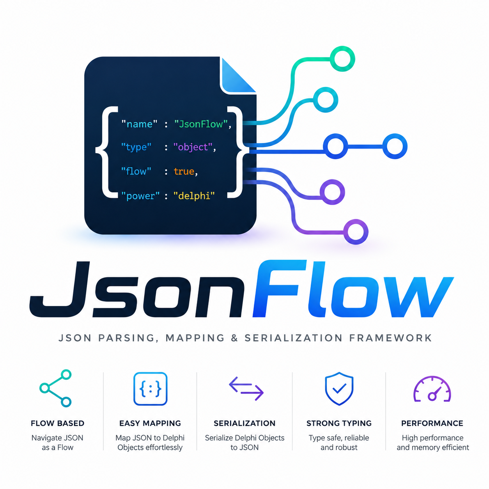
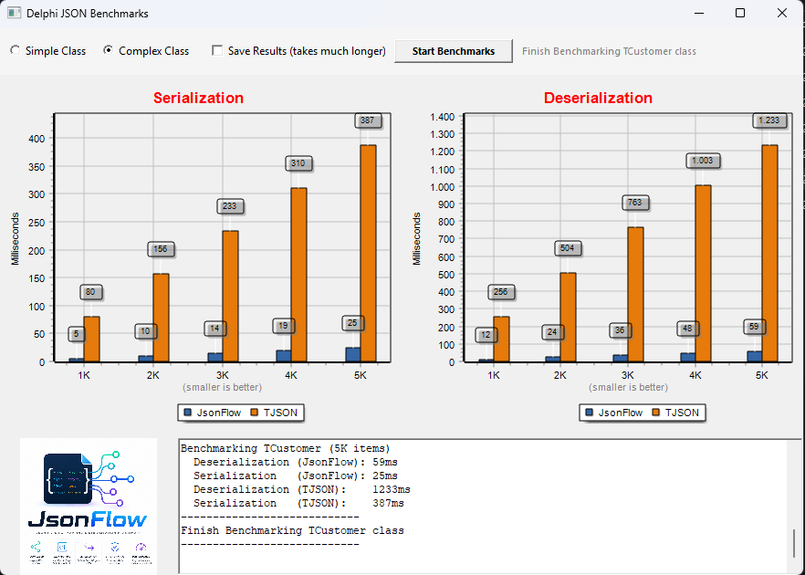
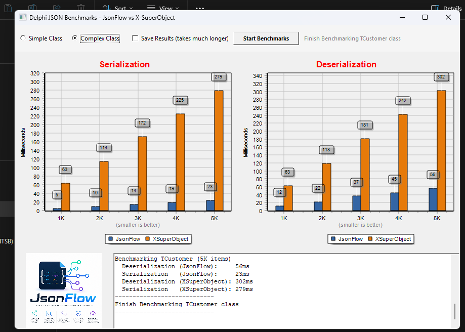

<p align="center">
  
</p>

# JsonFlow — High-performance JSON serialization, dynamic manipulation, and Draft-7 Schema validation for Delphi

[]()
[](LICENSE)
[](https://www.pubpascal.dev/packages/jsonflow)

> 🔒 **Supply-chain transparency (CRA-ready):** a machine-readable **SBOM** (CycloneDX) is published on the package portal — [pubpascal.dev/packages/jsonflow](https://www.pubpascal.dev/packages/jsonflow) · security disclosure policy in **[SECURITY.md](SECURITY.md)**.

📚 **[Documentation](https://moderndelphiworks.github.io/JsonFlow/)** · ⬇️ **[Download](../../releases)** · 🐛 **[Issues](../../issues)**

<div align="center">

**English** · [Português (PT-BR)](README.pt-BR.md)

</div>

---

**JsonFlow** is a state-of-the-art, high-performance, and feature-rich JSON manipulation, serialization, and JSON Schema validation framework for Delphi. It provides an enterprise-ready toolkit that integrates high-speed object serialization, in-place dynamic JSON editing, and robust Draft 7 JSON Schema validation under a unified, elegant, and fluent API. Every hot path — parsing, RTTI marshalling, path-based editing, and schema validation — has been profiled and optimized against public, reproducible benchmarks, delivering native speeds for intensive web applications, APIs, and microservices.

### 🚀 Key Features

*   **Advanced Serialization & Deserialization:** Fluidly convert Delphi objects to JSON structures and vice-versa using custom attributes, mapping rules, and extensible pipelines.
*   **In-Place Dynamic Composer:** Load and modify complex JSON structures in-place. Traverse nested elements fluidly using path strings (e.g., `user.address[0].zip`).
*   **Draft 7 JSON Schema Validation:** Fully validate JSON structures against Draft 7 specifications with detailed local error paths (`Path` and `SchemaPath`).
*   **Audited, Benchmark-Backed Performance** (July 2026 hot-path audit, reproducible console harnesses):
    *   *Serialization/Deserialization:* up to 15× faster serialization and 7× faster deserialization than X-SuperObject (see charts below).
    *   *Schema Validation:* 3.4× faster after identity-based compile caching, precompiled regex rules, and O(1) incremental error paths.
    *   *Path-based Editing:* array inserts and path operations up to 33× faster via `IJSONArray.Insert` and reusable navigation.
*   **Extensible Middleware System:** Intercept, encrypt, decrypt, or format specific JSON fields (e.g., dates, currency, custom types) on the fly — with a compiler-enforced contract validated at registration.

### 🏛 Compatibility Matrix

| Environment / IDE | Platform / Compiler | Draft 7 Validator | Custom Middlewares |
| :--- | :--- | :---: | :---: |
| **Delphi XE or superior** | VCL, FMX, Console (Win/Linux/macOS/iOS/Android) | ✅ Yes | ✅ Yes |

### 📊 Performance & Benchmarks

Below is a comparison demonstrating JsonFlow's performance superiority against standard native Delphi JSON:

<p align="center">
  
</p>

JsonFlow was also benchmarked against the popular [X-SuperObject](https://github.com/onryldz/x-superobject) library — Complex Class scenario (1K to 5K `TCustomer` objects with nested `Address` and `Contacts`). At the 5K scale (Release, Win32): **~7× faster deserialization** (47ms vs 319ms) and **~15× faster serialization** (19ms vs 298ms):

<p align="center">
  
</p>

> **Methodology:** identical entities and datasets for both libraries (the same suite used in the native TJSON comparison above); JSON text parsing is excluded from the timings on both sides, so the charts measure pure object marshalling; X-SuperObject received enums as ordinals in its input, since the library does not support string enums. Full benchmark source: [`Examples/VCL/JsonFlowBenchmarkXSO`](Examples/VCL/JsonFlowBenchmarkXSO).

### 🐧 Cross-Platform Build — Win32 / Win64 / Linux64

> **Win32 / Win64:** ✅ verified (2026-06-20, real production backend). **Linux64:** ✅ all 79 framework units compile standalone with `dcclinux64` (verified 2026-07-07, RAD Studio 37.0; the Horse middleware integration is out of scope as an external dependency). Linking a final executable still requires a Linux SDK, as described below.

**Building a consumer app for Linux64:** install the Linux 64-bit platform (RAD Studio GetIt / `GetItCmd -if=delphi_linux -ae`), provide a Linux SDK (RAD Studio SDK Manager + PAServer, **or** a sysroot assembled from a WSL/Linux toolchain passed to `dcclinux64` via `--syslibroot` / `--libpath`), then compile with `dcclinux64`.

### ⚙️ Installation

**Boss** (recommended):

```sh
boss install JsonFlow
```

**PubPascal** package portal: [pubpascal.dev/packages/jsonflow](https://www.pubpascal.dev/packages/jsonflow)

---

### ⚡️ Quick Start

#### 1. Automatic Object Serialization

```delphi
uses
  JsonFlow.Serializer,
  JsonFlow.Interfaces;

var
  LSerializer: TJSONSerializer;
  LJson: string;
  LUser, LUserCopy: TUser;
begin
  LSerializer := TJSONSerializer.Create;
  try
    LUser := TUser.Create;
    LUser.Name := 'John Doe';
    LUser.Age := 30;

    // Object to JSON String
    LJson := LSerializer.ObjectToJSON(LUser);

    // JSON String back to Object
    LUserCopy := LSerializer.JSONToObject<TUser>(LJson);
  finally
    LSerializer.Free;
  end;
end;
```

#### 2. In-Place Dynamic Updating (TJSONComposer)

```delphi
uses
  JsonFlow.Composer;

var
  LComposer: IJSONComposer;
  LUpdatedJson: string;
begin
  LComposer := TJSONComposer.Create;
  LComposer.LoadJSON('{"user":{"name":"John","age":30},"tags":["dev"]}');

  LComposer.SetValue('user.age', 31);
  LComposer.AddToArray('tags', 'lead');

  LUpdatedJson := LComposer.ToJSON(False);
end;
```

#### 3. Draft 7 JSON Schema Validation

```delphi
uses
  JsonFlow.SchemaValidator,
  JsonFlow.Interfaces;

var
  LValidator: TSchemaValidator;
  LSchema, LData: IJSONElement;
  LErrors: TList<TValidationError>;
begin
  LValidator := TSchemaValidator.Create;
  try
    LSchema := TJSONElement.ParseFromString(
      '{"type":"object","properties":{"name":{"type":"string","minLength":2}},"required":["name"]}');
    LData := TJSONElement.ParseFromString('{"name":"A"}'); // Fails minLength

    LValidator.Schema := LSchema;
    LErrors := LValidator.Validate(LData);

    if LErrors.Count > 0 then
      WriteLn('Validation failed on path: ' + LErrors[0].Path);
  finally
    LValidator.Free;
  end;
end;
```

---

## ⛏️ Contributing

Contributions are welcome — bug reports, documentation improvements, and pull requests all help.

[](../../issues)

**Steps:**

1. Fork the repository.
2. Create a feature branch: `git checkout -b feat/my-feature`
3. Commit your changes following the project conventions.
4. Open a Pull Request against `main` describing what changed and why.
5. Wait for review feedback.

---

## 📬 Contact

[](mailto:isaquesp@gmail.com)

---

## 💲 Donation

If JsonFlow saves you time, consider supporting its development.

[](https://link.mercadopago.com.br/isaquepinheiro)

---

## 📄 License

Distributed under the **MIT License**. See [LICENSE](LICENSE) for details.

*Copyright © 2025-2026 Isaque Pinheiro.*
